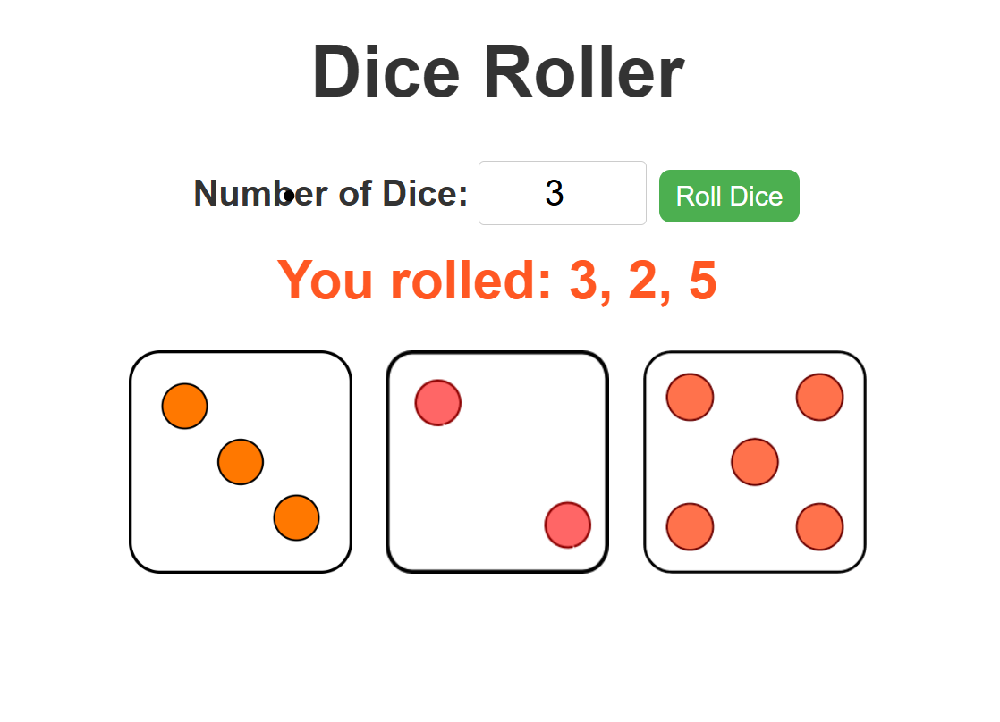

# 🎲 Dice Roller Web App

A fun and interactive web app to simulate rolling one or more dice. Built with **HTML**, **CSS**, and **JavaScript**, this project visually displays each die roll using real dice face images.

---

## 📸 Preview

---

## 🚀 Features

- 🎯 Roll any number of dice (1 or more).
- 🖼️ Displays accurate dice face images.
- 🎨 Responsive, centered, and styled UI.
- 🔁 Real-time dice roll updates.

---

---

## 📦 How to Run

1. **Download or clone** this repository.
2. Make sure `dice_images/` contains all dice images: `1.png` to `6.png`.
3. Open `index.html` in your browser.
4. Input number of dice, then click **"Roll Dice"**.

---

## 🛠️ Tech Stack

- HTML
- CSS
- JavaScript (Vanilla)

---

## ✨ Future Ideas

- 🎲 Add dice roll animation.
- 🔊 Include sound effect on roll.
- 🌙 Add dark mode toggle.

---

## 🙌 Acknowledgements

- Inspired by traditional dice games and modern UI styling practices.

---

